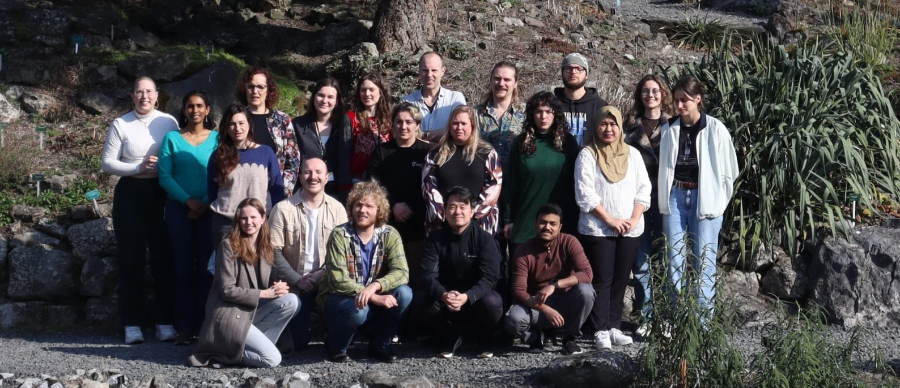

```{=html}
<div style="position: relative; width: 100%; margin-bottom: 1rem; margin-top: -1em;">
  
  <div style="position: absolute; bottom: 10%; left: 50%; transform: translateX(-50%); text-align: center; width: 90%;">
    <h2 style="color: white; font-size: clamp(1.5rem, 5vw, 3.5rem);">Welcome to The Jo Lab</h2>
    <p style="color: white; max-width: 800px; margin: 0 auto; font-size: clamp(0.9rem, 2vw, 1.25rem);"> 
      We study functional genomics in plant environmental responses and development. We are part of the Plant Stress Resilience group at the Utrecht University in the Netherlands.
    </p>
  </div>
</div>
```