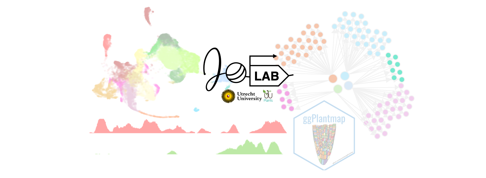

```{=html}
<div style="position: relative; width: 100vw; left: 50%; right: 50%; margin-left: -50vw; margin-right: -50vw; margin-top: -50px; margin-bottom: -20px; min-height: 70vh; overflow: hidden;">
  
  <div style="position: absolute; top: 0; left: 0; right: 0; bottom: 0; display: flex; flex-direction: column; justify-content: flex-end; align-items: center; background: rgba(0,0,0,0); text-align: center; padding: 0 20px 30px 20px;">
    <h2 style="color: black; font-size: clamp(3.5rem, 10vw, 3.5rem); margin: 0;">Welcome to the Jo Lab</h2>
    <p style="color: black; max-width: 800px; margin: 10px auto 0 auto; font-size: clamp(0.9rem, 2vw, 1.25rem);"> 
      We study functional genomics in plant environmental responses and development. We are part of the Plant Stress Resilience group at the Utrecht University in the Netherlands.
    </p>
  </div>
</div>
```

