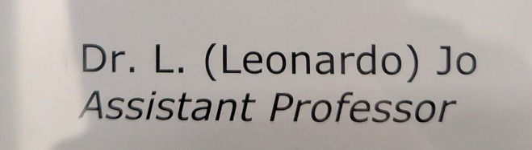
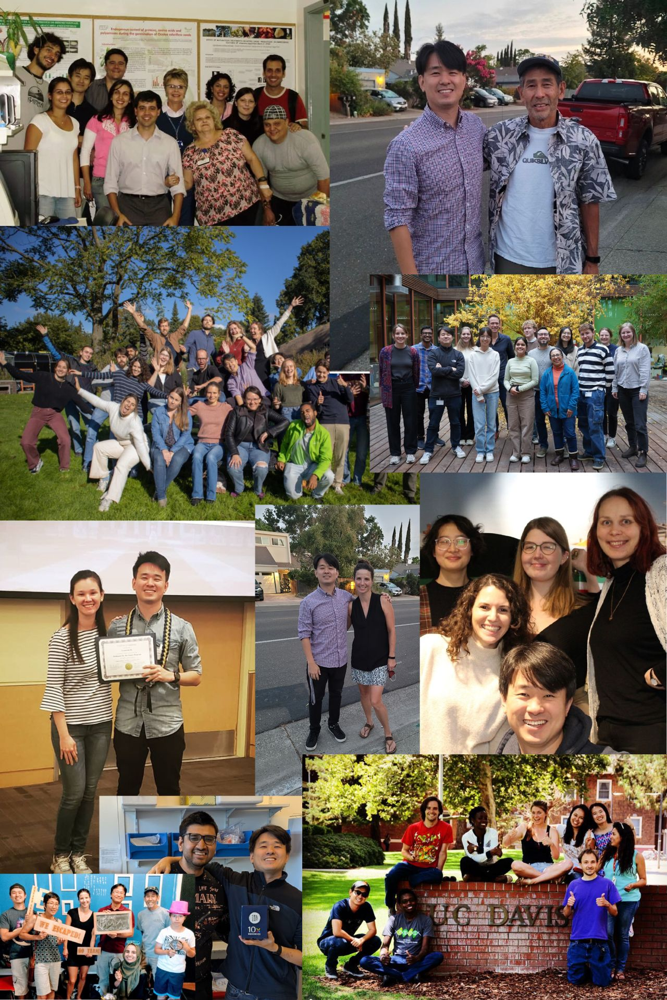

[ **Lab News**]{style="font-size: 24px;"}

------------------------------------------------------------------------

### **April 15th, 2026**
#### **Our first ever Phd position is open!**

I'm very excited to announce that the Jo Lab is hiring our FIRST EVER PhD candidate!
Passionate about plant stress responses, molecular biology, and bioinformatics? Join our lab as PhD candidate and investigate why unique plant cells respond so differently to the same environmental stimuli. You’ll gain hands-on experience with cutting-edge single-cell genomics and functional genomics to uncover the drivers of plant transcriptional responses to the environment. If you're eager to drive discovery in plants, join us at UU Plants!

<a href=https://www.uu.nl/en/organisation/working-at-utrecht-university/jobs/phd-position-in-the-role-of-cell-identity-in-shaping-plant-stress-responses>More info</a>

------------------------------------------------------------------------

### **February 1st, 2026**
#### **The Jo Lab started!**

As of today, our lab started!
I'm super excited to join the Plant Stress Resilience group chaired by [**Rashmi Sasidharan**](https://www.linkedin.com/in/rashmi-sasidharan-9708ba9/). My research will focus on understanding how the interaction between transcription factors and chromatin states shape plant environmental responses. Since starting grad school I have dreamed about this moment and I hope to inspire the next generation of plant biologists with the same patience, care and dedication shown to me by the many mentors and colleagues who guided me throughout my journey.

{fig-align="left" width="306"}

{width="600"}

------------------------------------------------------------------------

### **November 1st, 2025**
#### **Leonardo Jo was awarded the prestigious VENI Grant**

The Veni Grant is part of the NWO Talent Program and it is aimed at newly promoted researchers. Researchers eligible for a Veni grant have academic qualities that clearly exceed what is usual. The funding amounts to a maximum of €320,000.

I'm very honored to have received this grant. We will focus in understanding the role of of pioneer factors in specifying chromatin accessible domains during developmental transitions.

[**More Information**](https://www.nwo.nl/en/researchprogrammes/nwo-talent-programme/projects-veni/veni-2024)
