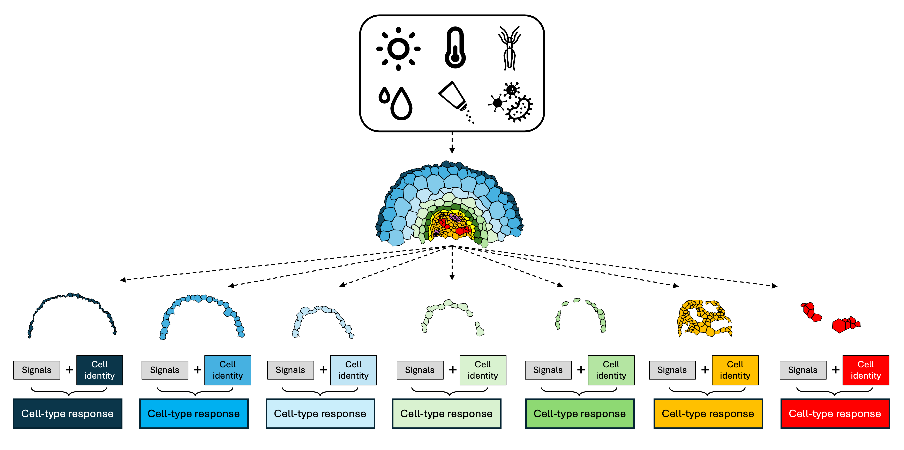
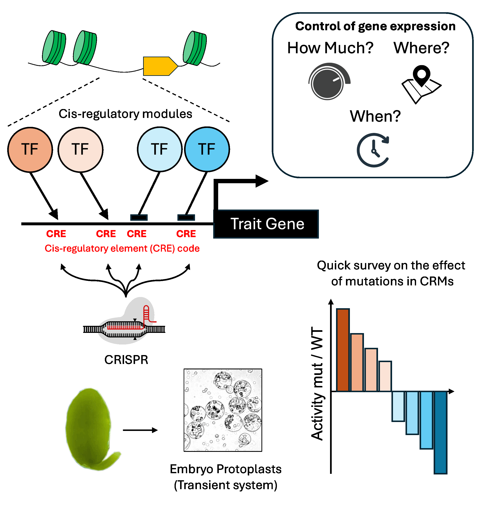

[**Our Research**]{style="font-size: 24px;"}

Functional Genomics in Plant Environmental Responses and Development

------------------------------------------------------------------------

  <table style="width: 100%; border-collapse: collapse; margin-bottom: 30px; background: transparent;">
    <tr>
      <td style="width: 50%; vertical-align: top; padding-right: 20px;">
        
      </td>
      <td style="width: 50%; vertical-align: top;">
        <h3 style="margin-top: 20px; margin-bottom: 40px;text-align:center; font-family: 'Arial Black'; font-size: 24px; color: black;">How Plants Reprogram Their Transcriptome in Response to Environmental Cues?</h3>
        

My research has been motivated by a fundamental question: how does the environment shape the onset of new transcriptional programs in plants? Due to their sessile nature, plants developed special strategies to timely respond and acclimate to a dynamic and changing environment. When encountering stressful conditions, plants have the capability to undergo a complete transcriptional reprogramming to adjust their metabolism, growth, and development to acclimate and survive through environmental challenges.

        

In my group we combine functional genomics and single-cell technologies to understand how environmental factors shape plant responses through the lens of transcriptional and chromatin organization.

      </td>
    </tr>
  </table>

------------------------------------------------------------------------

  <table style="width: 100%; border-collapse: collapse; margin-bottom: 30px; background: transparent;">
    <tr>
      <td style="width: 50%; vertical-align: top; padding-right: 20px;">
     <h3 style="margin-top: 20px; margin-bottom: 40px;text-align:center; font-family: 'Arial Black'; font-size: 24px; color: black;">Using functional genomics to quantitatively engineer crop traits by genome editing</h3>
        

Conventional mutagenesis and gene editing approaches typically target coding sequences to alter gene activity. However, these all-or-nothing strategies do not enable precise quantitative control of traits. In previous work, I demonstrated that functional genomics approaches can be used to identify non-coding regulatory regions that serve as hubs for transcription factor interactions regulating gene expression. Targeted modification of certain cis-regulatory elements (CREs) allowed for the quantitative control of gene activity. These findings highlight the potential of CRE identification and manipulation as a powerful strategy for quantitatively fine-tuning gene activity and plant traits. Our group will focus on identifying and targeting these cis-regulatory modules (CRMs) and leveraging them to achieve quantitative control of genes underlying plant responses.

      </td>
      <td style="width: 50%; vertical-align: middle;">
  
      </td>
    </tr>
  </table>

------------------------------------------------------------------------